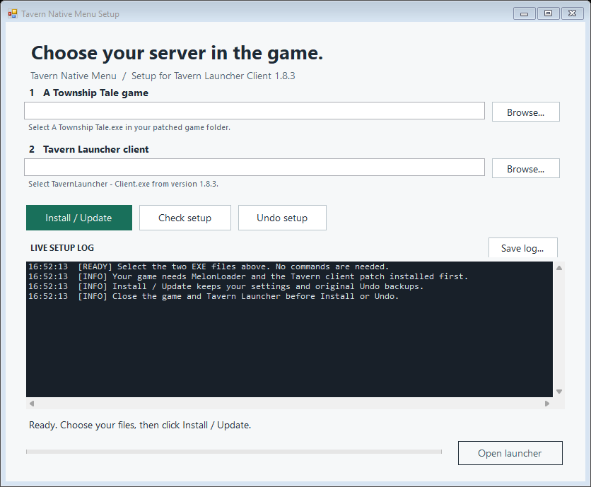

<div align="center">

# ⚓ Tavern Native Menu

### Launch your game. Choose your server in VR.

Bring Tavern's community servers, private bookmarks and friends into **A Township Tale's original menus**.


**[📦 Download package](setup-v1.8.3/dist/TavernNativeMenuSetup-for-1.8.3.zip)** · **[Installation guide](setup-v1.8.3/README.md)** · **[Host friends relay](setup-v1.8.3/social-server/SOCIAL-HOSTING.md)** · **[Report an issue](https://github.com/wolftech07/Wolf-s-core-mods/issues)**

</div>

---

Click **Play Game** in Tavern Launcher to open the native server picker. Browse the community list, use your saved servers, and authenticate when you join—all without choosing a server before launch.

<p align="center">
  
</p>

> [!IMPORTANT]
> This build targets **Tavern Launcher Client 1.8.3** and the compatible Windows/Mono game build. Automated checks pass, but headset controls, physical friend-card exchanges and invitations between two real game clients still need VR testing.

## ✨ What’s included

| Feature | What you can do |
| :--- | :--- |
| **Native server picker** | Browse Tavern community, saved and recent servers inside the game. |
| **Play Game integration** | Open the picker directly from Tavern Launcher. |
| **Wheel and rope repair** | Use native scrolling without the missing-lever startup failure. |
| **VR password keyboard** | Enter passwords using the game's touch keyboard, with masked input. |
| **Private servers** | Save an address locally without publishing it to the community dashboard. |
| **Friends and invitations** | Use the native friends boards and cards with the optional shared relay and server companion. |
| **Simple updates** | Install or update from one EXE, with live logs, backups and Undo. |

## 🚀 Start playing

### 1 · Prepare your game

Use Tavern Launcher's normal **Patch** and **Mods** controls to install the compatible Tavern client patch and Mono MelonLoader. Save your username, game path and platform in the launcher.

You need Windows, **.NET Framework 4.8**, **Windows PowerShell 5.1**, and **Tavern Launcher Client 1.8.3**. The package does not include the game, launcher, MelonLoader or TavernLib.

### 2 · Install the mod

1. Download and extract **[TavernNativeMenuSetup-for-1.8.3.zip](setup-v1.8.3/dist/TavernNativeMenuSetup-for-1.8.3.zip)**. On GitHub's file page, use **Download raw file** if the ZIP does not download immediately.
2. Close the game and Tavern Launcher.
3. Run **TavernNativeMenuSetup.exe** and browse to your game EXE and version **1.8.3** launcher EXE.
4. Click **Install / Update** and wait for the live log to confirm completion.

**No commands, Python installation or compilation needed.**

### 3 · Choose a server in VR

Open Tavern Launcher, click **Play Game**, then select a server in the original game menu. Password and whitelist requirements still apply.

| Updating? | Removing the integration? |
| :--- | :--- |
| Run the new setup EXE and choose **Install / Update**. Your settings and original Undo backups are retained. | Close the game and launcher, then choose **Undo setup**. The installer restores the files it backed up. |

[Read the full installation and recovery guide →](setup-v1.8.3/README.md)

## 🏡 Keep a server private

Choose **Add a private server...** in the picker. Enter its hostname or IPv4 address, friendly name and ports using the VR keyboard.

Your bookmark appears in **Favorites** and **Saved / Recent**. The default game port is **1757** and authentication port is **1762**. The mod does not submit this address to the community dashboard; the server owner's own listing settings still apply.

## 🤝 Play with friends

One person runs **TavernNativeSocialHost.exe** for the group. Players connect to that shared relay from **Connect friends service...** on the native friends board.

| Step | In the game |
| :---: | :--- |
| **1** | Connect both clients to the same relay. |
| **2** | Exchange native friendship cards on a game server with the companion installed. |
| **3** | Select a friend and invite them to a saved or private server. |
| **4** | Accept the invitation from the friends board or **Requests** tab. Normal join checks still apply. |

Your client controls your presence: you appear offline within about a minute after it stops sending heartbeats. Invitations share the destination with the chosen recipient, without including passwords or login tokens. Existing Alta/Oculus friends are not imported.

> [!NOTE]
> Internet invitations require a **reachable HTTPS relay**. This package includes the host software, not a pre-hosted service. Adding friends through cards also requires the companion on the game server where you exchange them.

[Set up the relay and server companion →](setup-v1.8.3/social-server/SOCIAL-HOSTING.md)

## 🛠️ Need a hand?

<details>
<summary><strong>The launcher still shows “Join Server”</strong></summary>

Close and reopen the version 1.8.3 launcher selected during setup. In its Addons window, enable **Tavern Native Menu - Play Game**. Running **Install / Update** again can re-enable it.

</details>

<details>
<summary><strong>The relay reports an error</strong></summary>

Click **Start relay**, then **Test connection** in the host app. Check its live log or the automatic log at `%LOCALAPPDATA%\TavernNativeSocialRelay\host.log`.

`127.0.0.1` reaches only your own computer. Other players need the shared HTTPS address. The [hosting guide](setup-v1.8.3/social-server/SOCIAL-HOSTING.md#if-the-relay-shows-an-error) covers port conflicts, certificates and connection failures.

</details>

<details>
<summary><strong>A server or friend card will not connect</strong></summary>

Check the server's normal password and whitelist requirements. For card exchanges, both players must use the same relay and the game server must have the configured companion.

For a bug report, include the action that failed, the exact error, and relevant setup or MelonLoader log lines. Review logs for personal paths before sharing. Keep credential files such as `TavernSocial.json` and `TavernNativeSocialServer.json` private.

</details>

[More troubleshooting →](setup-v1.8.3/README.md#troubleshooting)

## 🧪 Verification and compatibility

The release has been compiled against the inspected game assemblies and checked with installer fixtures, wheel/rope instruction tests, keyboard tests, native API binding checks, and relay/client integration tests. Two isolated instances of the production social client have exchanged invitations through the real local relay.

**Those tests do not replace a two-player VR session.** Fly mode uses the original VR-oriented menu; there is no separate desktop picker. Launcher add-ons that need server-specific work before launch, such as custom-model syncing, are not integrated with in-game selection.

[Detailed test coverage and limitations →](setup-v1.8.3/README.md#compatibility-and-testing)

## 📁 For contributors

```text
setup-v1.8.3/
├── mod-src/          In-game menu and social client
├── src/              Windows setup interface
├── payload/          Installer worker, mod DLL and launcher add-on
├── social-server/    Relay host and game-server companion
├── tests/            Automated checks
└── dist/             Current distributable package
```

The build uses Windows' .NET Framework compiler; no NuGet restore or .NET SDK is required. Compatible game assemblies are needed to rebuild the mod and companion. See the **[maintainer instructions](setup-v1.8.3/README.md#for-maintainers)** for build commands.

**ILSpy is optional:** `tools/ilspycmd/` is a local inspection tool, not a build dependency, and is excluded from Git along with decompiled research and generated test fixtures. The project's own release binaries remain tracked.